# ts2 examples

**ts2** is a small, statically typed, declarative language with inline templating, flavoured like React and TypeScript. You describe what a user interface looks like, what happens when state changes and events are fired, and the rest happens automatically.

📖 **Documentation: <https://playrift.co/docs/ts2/>**

```tsx
export function ThinBox({ children }: { children?: Children }): Component {
  return (
    <layer w="fill" h="fill">
      <rect x="center" y="center" w="fill" h="fill" color={0x0e0e0c} />
      <rect x="center" y="center" w={{ fill: 2 }} h={{ fill: 2 }} color={0x474745} />
      <layer w="fill" h="fill">
        {children}
      </layer>
    </layer>
  );
}
```

ts2 grew out of [Rift](https://playrift.co), and this repository is a set of worked
examples demonstrating the language and providing references for what idiomatic ts2 looks like. Every UI is a **recreation of a user interface from 235 era osrs**, rebuilt in ts2. Where a folder has a `_preview.png`, that picture is a render of the compiled ts2 source at runtime.
Every preview comes in a pair — `_preview.png` and `_preview.mobile.png` — because each UI is built once and rendered on both the desktop and the mobile client.

## Folders

### `<id>_<name>/` — one folder per user interface

Every folder is named for the user interface id it recreates, then that UI's name.
Each picture below is that folder's `_preview.png`, rendered from the ts2 source
next to it; the picture and the name both link into the folder.

| | | |
|:-:|:-:|:-:|
| <a href="0002_rangingguild_ticketexchange/">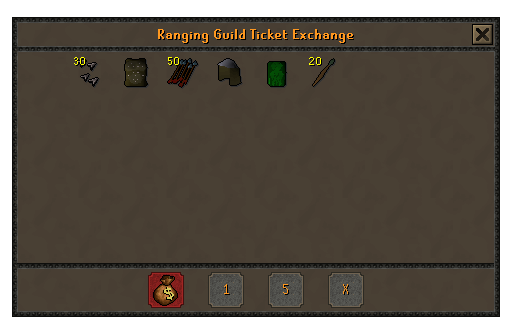</a><br><a href="0002_rangingguild_ticketexchange/"><code>0002_rangingguild_ticketexchange</code></a> | <a href="0011_objectbox_double/"></a><br><a href="0011_objectbox_double/"><code>0011_objectbox_double</code></a> | <a href="0018_osm_controls_guide/">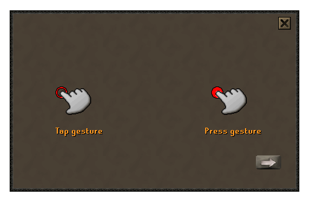</a><br><a href="0018_osm_controls_guide/"><code>0018_osm_controls_guide</code></a> |
| <a href="0020_bond_prompt/">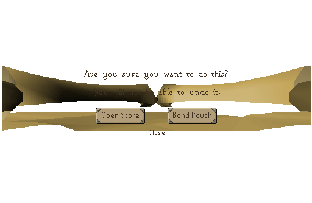</a><br><a href="0020_bond_prompt/"><code>0020_bond_prompt</code></a> | <a href="0023_tob_chests/">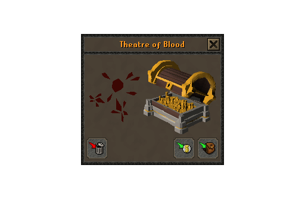</a><br><a href="0023_tob_chests/"><code>0023_tob_chests</code></a> | <a href="0025_barrows_puzzle/">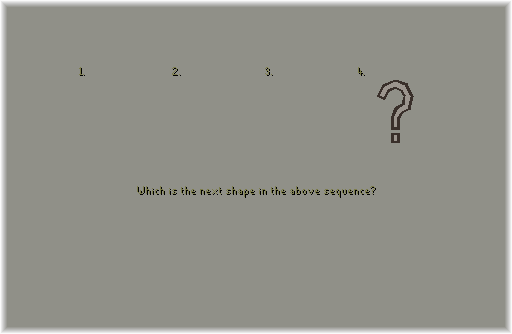</a><br><a href="0025_barrows_puzzle/"><code>0025_barrows_puzzle</code></a> |
| <a href="0027_pillory/">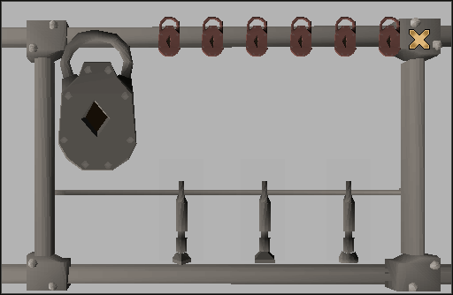</a><br><a href="0027_pillory/"><code>0027_pillory</code></a> | <a href="0031_boardgames_challenge/">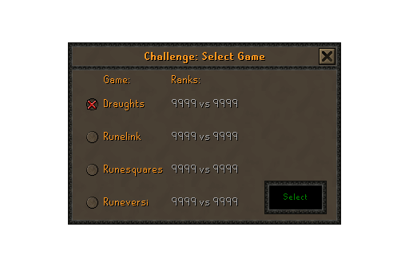</a><br><a href="0031_boardgames_challenge/"><code>0031_boardgames_challenge</code></a> | <a href="0032_boardgames_draughts/">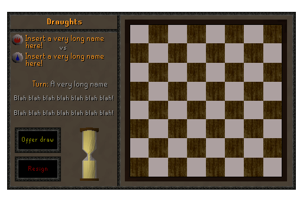</a><br><a href="0032_boardgames_draughts/"><code>0032_boardgames_draughts</code></a> |
| <a href="0033_boardgames_draughts_options/"></a><br><a href="0033_boardgames_draughts_options/"><code>0033_boardgames_draughts_options</code></a> | <a href="0036_boardgames_runelink/">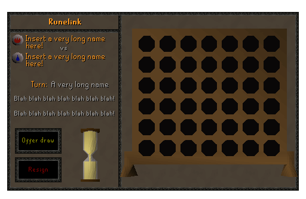</a><br><a href="0036_boardgames_runelink/"><code>0036_boardgames_runelink</code></a> | <a href="0037_boardgames_runelink_options/"></a><br><a href="0037_boardgames_runelink_options/"><code>0037_boardgames_runelink_options</code></a> |
| <a href="0041_boardgames_runesquares_options/"></a><br><a href="0041_boardgames_runesquares_options/"><code>0041_boardgames_runesquares_options</code></a> | <a href="0045_boardgames_runeversi_options/">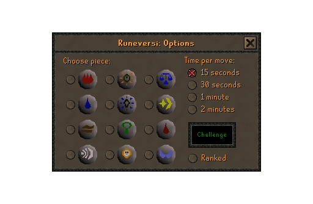</a><br><a href="0045_boardgames_runeversi_options/"><code>0045_boardgames_runeversi_options</code></a> | <a href="0054_castlewars_catapult/">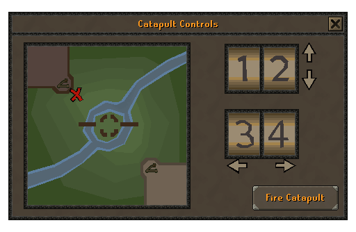</a><br><a href="0054_castlewars_catapult/"><code>0054_castlewars_catapult</code></a> |
| <a href="0060_chat_both/">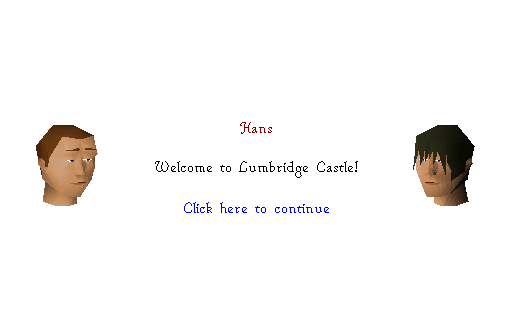</a><br><a href="0060_chat_both/"><code>0060_chat_both</code></a> | <a href="0063_congratulations/">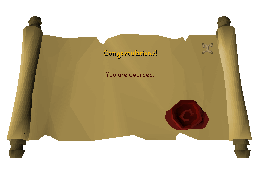</a><br><a href="0063_congratulations/"><code>0063_congratulations</code></a> | <a href="0064_league_rank/">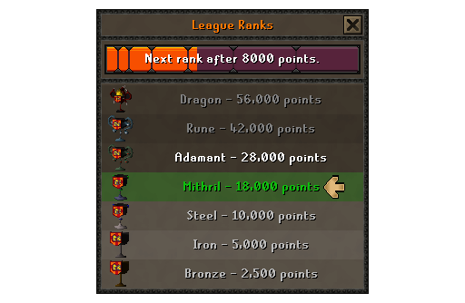</a><br><a href="0064_league_rank/"><code>0064_league_rank</code></a> |
| <a href="0065_crm_surprisepopup_side/"></a><br><a href="0065_crm_surprisepopup_side/"><code>0065_crm_surprisepopup_side</code></a> | <a href="0066_crm_surprisepopup_main/"></a><br><a href="0066_crm_surprisepopup_main/"><code>0066_crm_surprisepopup_main</code></a> | <a href="0067_anma_reward/">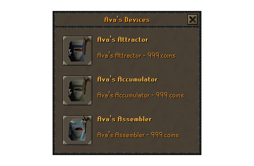</a><br><a href="0067_anma_reward/"><code>0067_anma_reward</code></a> |
| <a href="0068_slayer-partner/">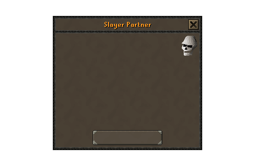</a><br><a href="0068_slayer-partner/"><code>0068_slayer-partner</code></a> | <a href="0073_trail_rewardscreen/">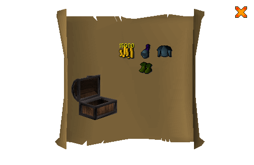</a><br><a href="0073_trail_rewardscreen/"><code>0073_trail_rewardscreen</code></a> | <a href="0108_cr_tutorial/">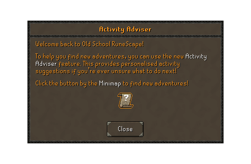</a><br><a href="0108_cr_tutorial/"><code>0108_cr_tutorial</code></a> |
| <a href="0125_farming_tools/">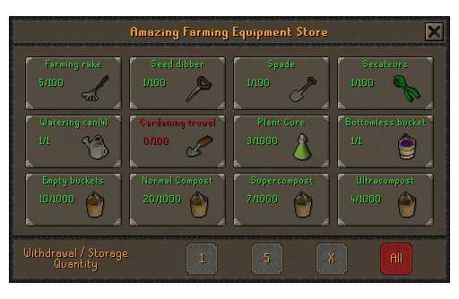</a><br><a href="0125_farming_tools/"><code>0125_farming_tools</code></a> | <a href="0126_farming_tools_side/">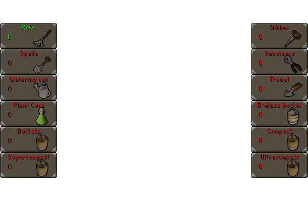</a><br><a href="0126_farming_tools_side/"><code>0126_farming_tools_side</code></a> | <a href="0128_hosidius_seedbox/">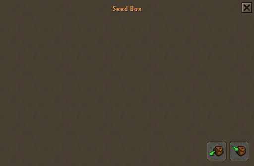</a><br><a href="0128_hosidius_seedbox/"><code>0128_hosidius_seedbox</code></a> |
| <a href="0138_glidermap/">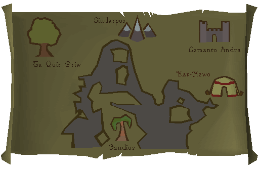</a><br><a href="0138_glidermap/"><code>0138_glidermap</code></a> | <a href="0155_barrows_reward/">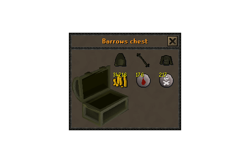</a><br><a href="0155_barrows_reward/"><code>0155_barrows_reward</code></a> | <a href="0167_snow_flakes/"></a><br><a href="0167_snow_flakes/"><code>0167_snow_flakes</code></a> |
| <a href="0181_prif_recipes/">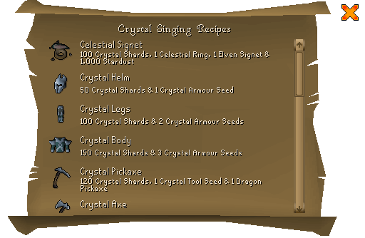</a><br><a href="0181_prif_recipes/"><code>0181_prif_recipes</code></a> | <a href="0188_macro_mime_emotes/">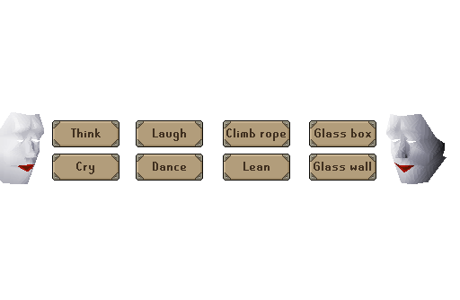</a><br><a href="0188_macro_mime_emotes/"><code>0188_macro_mime_emotes</code></a> | <a href="0211_poh_menagerie/">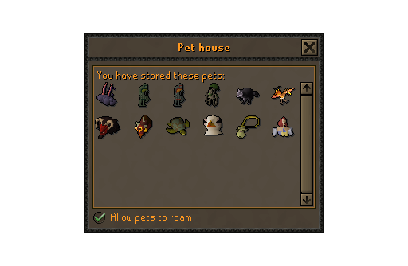</a><br><a href="0211_poh_menagerie/"><code>0211_poh_menagerie</code></a> |
| <a href="0217_chat_right/">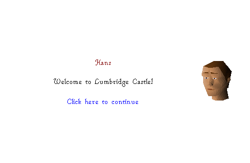</a><br><a href="0217_chat_right/"><code>0217_chat_right</code></a> | <a href="0226_deadmanprotect/">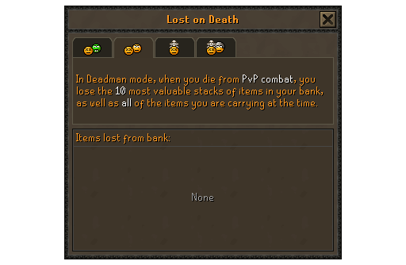</a><br><a href="0226_deadmanprotect/"><code>0226_deadmanprotect</code></a> | <a href="0227_needed-items-list/">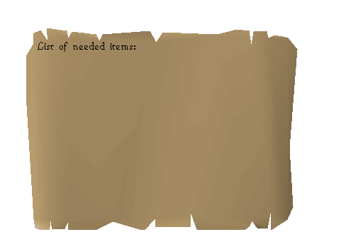</a><br><a href="0227_needed-items-list/"><code>0227_needed-items-list</code></a> |
| <a href="0230_deadman_safebox/">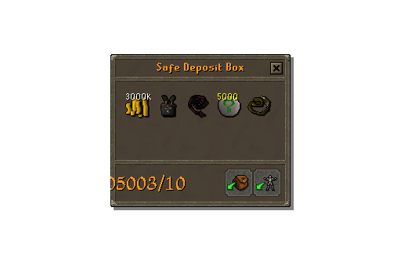</a><br><a href="0230_deadman_safebox/"><code>0230_deadman_safebox</code></a> | <a href="0231_chat_left/">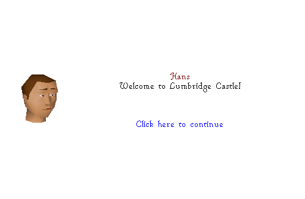</a><br><a href="0231_chat_left/"><code>0231_chat_left</code></a> | <a href="0233_levelup_display/"></a><br><a href="0233_levelup_display/"><code>0233_levelup_display</code></a> |
| <a href="0236_hosidius_strip_rewards/">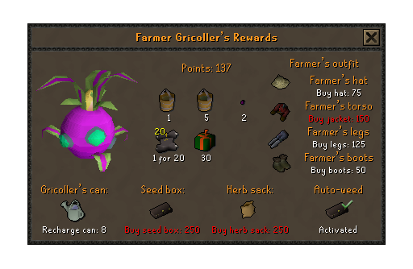</a><br><a href="0236_hosidius_strip_rewards/"><code>0236_hosidius_strip_rewards</code></a> | <a href="0242_hosidius_servery/">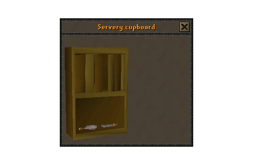</a><br><a href="0242_hosidius_servery/"><code>0242_hosidius_servery</code></a> | <a href="0246_colosseum_reward_chest/">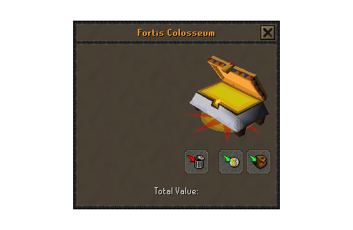</a><br><a href="0246_colosseum_reward_chest/"><code>0246_colosseum_reward_chest</code></a> |
| <a href="0259_area_task/">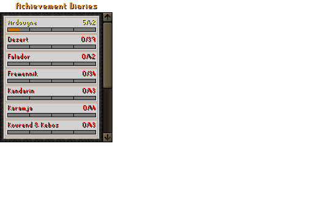</a><br><a href="0259_area_task/"><code>0259_area_task</code></a> | <a href="0265_partydrop_main/">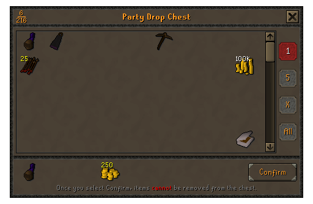</a><br><a href="0265_partydrop_main/"><code>0265_partydrop_main</code></a> | <a href="0269_f2p_bond_redeem/">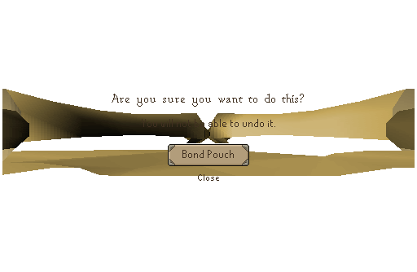</a><br><a href="0269_f2p_bond_redeem/"><code>0269_f2p_bond_redeem</code></a> |
| <a href="0270_skillmulti/">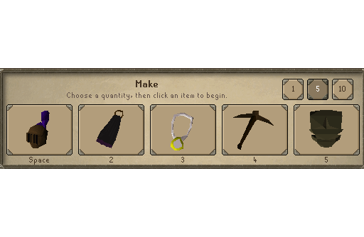</a><br><a href="0270_skillmulti/"><code>0270_skillmulti</code></a> | <a href="0271_raids_storage_private/">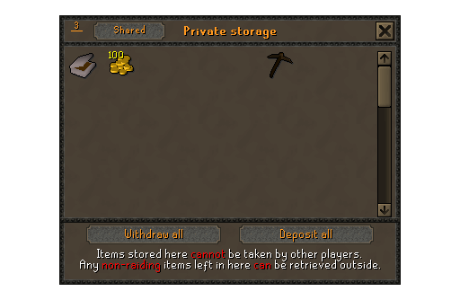</a><br><a href="0271_raids_storage_private/"><code>0271_raids_storage_private</code></a> | <a href="0272_priestperil_gravemonument/">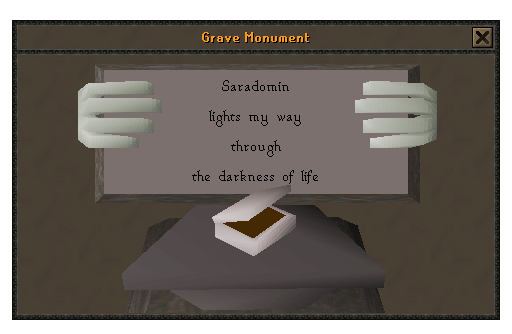</a><br><a href="0272_priestperil_gravemonument/"><code>0272_priestperil_gravemonument</code></a> |
| <a href="0274_trek_rewards/">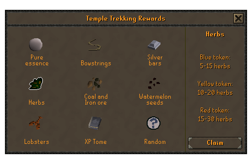</a><br><a href="0274_trek_rewards/"><code>0274_trek_rewards</code></a> | <a href="0284_membership_benefits_prompt/">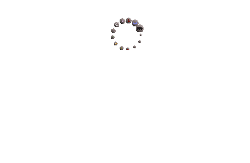</a><br><a href="0284_membership_benefits_prompt/"><code>0284_membership_benefits_prompt</code></a> | <a href="0287_fossil_underwater_training/">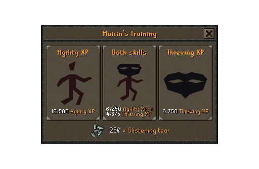</a><br><a href="0287_fossil_underwater_training/"><code>0287_fossil_underwater_training</code></a> |
| <a href="0292_roguetrader_sudoku/">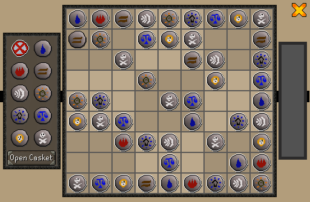</a><br><a href="0292_roguetrader_sudoku/"><code>0292_roguetrader_sudoku</code></a> | <a href="0302_horror_prayerbooks/">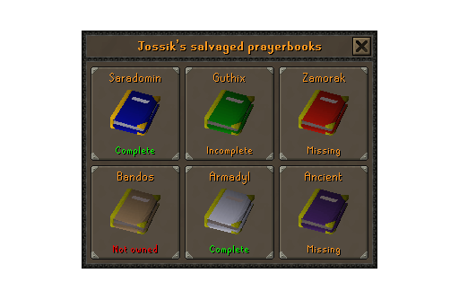</a><br><a href="0302_horror_prayerbooks/"><code>0302_horror_prayerbooks</code></a> | <a href="0305_ds2_fossil_map/">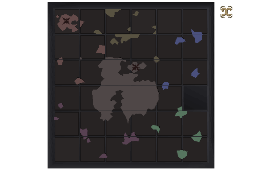</a><br><a href="0305_ds2_fossil_map/"><code>0305_ds2_fossil_map</code></a> |
| <a href="0306_trail_slidepuzzle/">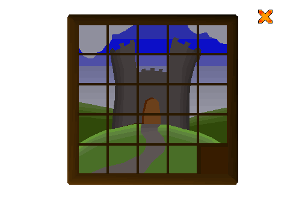</a><br><a href="0306_trail_slidepuzzle/"><code>0306_trail_slidepuzzle</code></a> | <a href="0309_fossil_driftnet_store/">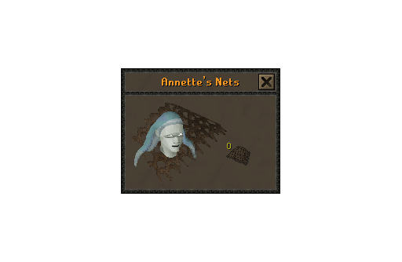</a><br><a href="0309_fossil_driftnet_store/"><code>0309_fossil_driftnet_store</code></a> | <a href="0322_light_puzzle/">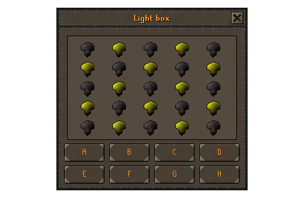</a><br><a href="0322_light_puzzle/"><code>0322_light_puzzle</code></a> |
| <a href="0323_tai_bwo_wannai_post/">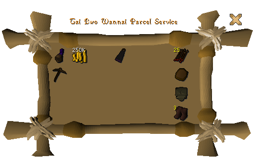</a><br><a href="0323_tai_bwo_wannai_post/"><code>0323_tai_bwo_wannai_post</code></a> | <a href="0332_thormac/"></a><br><a href="0332_thormac/"><code>0332_thormac</code></a> | <a href="0334_tradeconfirm/"></a><br><a href="0334_tradeconfirm/"><code>0334_tradeconfirm</code></a> |
| <a href="0367_trawler_reward/"></a><br><a href="0367_trawler_reward/"><code>0367_trawler_reward</code></a> | <a href="0370_house-options/"></a><br><a href="0370_house-options/"><code>0370_house-options</code></a> | <a href="0371_wom-recycling/"></a><br><a href="0371_wom-recycling/"><code>0371_wom-recycling</code></a> |
| <a href="0386_wom_telescope/"></a><br><a href="0386_wom_telescope/"><code>0386_wom_telescope</code></a> | <a href="0387_equipment/"></a><br><a href="0387_equipment/"><code>0387_equipment</code></a> | <a href="0388_br_reward/"></a><br><a href="0388_br_reward/"><code>0388_br_reward</code></a> |
| <a href="0397_poh_furniture_creation_menu/"></a><br><a href="0397_poh_furniture_creation_menu/"><code>0397_poh_furniture_creation_menu</code></a> | <a href="0405_tob_midway_stores/"></a><br><a href="0405_tob_midway_stores/"><code>0405_tob_midway_stores</code></a> | <a href="0411_warguild_defence_mini/"></a><br><a href="0411_warguild_defence_mini/"><code>0411_warguild_defence_mini</code></a> |
| <a href="0416_canoeing/"></a><br><a href="0416_canoeing/"><code>0416_canoeing</code></a> | <a href="0417_brew_tools/"></a><br><a href="0417_brew_tools/"><code>0417_brew_tools</code></a> | <a href="0428_room-timer-overlay/"></a><br><a href="0428_room-timer-overlay/"><code>0428_room-timer-overlay</code></a> |
| <a href="0445_league_rankings/"></a><br><a href="0445_league_rankings/"><code>0445_league_rankings</code></a> | <a href="0459_tob_infoboard/"></a><br><a href="0459_tob_infoboard/"><code>0459_tob_infoboard</code></a> | <a href="0462_slug2_torn_paper/"></a><br><a href="0462_slug2_torn_paper/"><code>0462_slug2_torn_paper</code></a> |
| <a href="0464_ge_pricechecker/"></a><br><a href="0464_ge_pricechecker/"><code>0464_ge_pricechecker</code></a> | <a href="0475_wilderness_warningscreen/"></a><br><a href="0475_wilderness_warningscreen/"><code>0475_wilderness_warningscreen</code></a> | <a href="0476_br_settings/"></a><br><a href="0476_br_settings/"><code>0476_br_settings</code></a> |
| <a href="0477_hunting_customfurs/"></a><br><a href="0477_hunting_customfurs/"><code>0477_hunting_customfurs</code></a> | <a href="0478_bank_deposit_imp/"></a><br><a href="0478_bank_deposit_imp/"><code>0478_bank_deposit_imp</code></a> | <a href="0483_lumbridge_alchemy/"></a><br><a href="0483_lumbridge_alchemy/"><code>0483_lumbridge_alchemy</code></a> |
| <a href="0492_soul_wars_clan_games/"></a><br><a href="0492_soul_wars_clan_games/"><code>0492_soul_wars_clan_games</code></a> | <a href="0518_trek_follower_inv/"></a><br><a href="0518_trek_follower_inv/"><code>0518_trek_follower_inv</code></a> | <a href="0539_raids_rewards/"></a><br><a href="0539_raids_rewards/"><code>0539_raids_rewards</code></a> |
| <a href="0540_ii_elnocks_exchange/"></a><br><a href="0540_ii_elnocks_exchange/"><code>0540_ii_elnocks_exchange</code></a> | <a href="0550_raids_storage_shared/"></a><br><a href="0550_raids_storage_shared/"><code>0550_raids_storage_shared</code></a> | <a href="0551_raids_storage_side/"></a><br><a href="0551_raids_storage_side/"><code>0551_raids_storage_side</code></a> |
| <a href="0555_mistmyst_gem_puzzle/"></a><br><a href="0555_mistmyst_gem_puzzle/"><code>0555_mistmyst_gem_puzzle</code></a> | <a href="0556_apothecary_potions/"></a><br><a href="0556_apothecary_potions/"><code>0556_apothecary_potions</code></a> | <a href="0582_decant/"></a><br><a href="0582_decant/"><code>0582_decant</code></a> |
| <a href="0592_dizanas_quiver/"></a><br><a href="0592_dizanas_quiver/"><code>0592_dizanas_quiver</code></a> | <a href="0602_gravestone_retrieval/"></a><br><a href="0602_gravestone_retrieval/"><code>0602_gravestone_retrieval</code></a> | <a href="0605_fossil_storage/"></a><br><a href="0605_fossil_storage/"><code>0605_fossil_storage</code></a> |
| <a href="0607_fossil_driftnet/"></a><br><a href="0607_fossil_driftnet/"><code>0607_fossil_driftnet</code></a> | <a href="0612_fossil_volcanic_shop/"></a><br><a href="0612_fossil_volcanic_shop/"><code>0612_fossil_volcanic_shop</code></a> | <a href="0615_aide_map/"></a><br><a href="0615_aide_map/"><code>0615_aide_map</code></a> |
| <a href="0616_misc_collection/"></a><br><a href="0616_misc_collection/"><code>0616_misc_collection</code></a> | <a href="0617_mobile_rating/"></a><br><a href="0617_mobile_rating/"><code>0617_mobile_rating</code></a> | <a href="0619_1v1arena_review/"></a><br><a href="0619_1v1arena_review/"><code>0619_1v1arena_review</code></a> |
| <a href="0620_1v1arena_results/"></a><br><a href="0620_1v1arena_results/"><code>0620_1v1arena_results</code></a> | <a href="0624_lovaquest_electricity/"></a><br><a href="0624_lovaquest_electricity/"><code>0624_lovaquest_electricity</code></a> | <a href="0625_message-scroll/"></a><br><a href="0625_message-scroll/"><code>0625_message-scroll</code></a> |
| <a href="0628_pest_scores/"></a><br><a href="0628_pest_scores/"><code>0628_pest_scores</code></a> | <a href="0631_seed-vault/"></a><br><a href="0631_seed-vault/"><code>0631_seed-vault</code></a> | <a href="0632_hallowed_tool_side/"></a><br><a href="0632_hallowed_tool_side/"><code>0632_hallowed_tool_side</code></a> |
| <a href="0635_lighttemple_pillar/"></a><br><a href="0635_lighttemple_pillar/"><code>0635_lighttemple_pillar</code></a> | <a href="0640_gauntlet_recipes/"></a><br><a href="0640_gauntlet_recipes/"><code>0640_gauntlet_recipes</code></a> | <a href="0645_br_reward_shop/"></a><br><a href="0645_br_reward_shop/"><code>0645_br_reward_shop</code></a> |
| <a href="0647_canoe_map/"></a><br><a href="0647_canoe_map/"><code>0647_canoe_map</code></a> | <a href="0648_target_streaks/"></a><br><a href="0648_target_streaks/"><code>0648_target_streaks</code></a> | <a href="0652_league_skillcapes_shop/"></a><br><a href="0652_league_skillcapes_shop/"><code>0652_league_skillcapes_shop</code></a> |
| <a href="0661_ii_elnock_storage/"></a><br><a href="0661_ii_elnock_storage/"><code>0661_ii_elnock_storage</code></a> | <a href="0665_myq5_tomb_puzzle/"></a><br><a href="0665_myq5_tomb_puzzle/"><code>0665_myq5_tomb_puzzle</code></a> | <a href="0666_hallowed_tools/"></a><br><a href="0666_hallowed_tools/"><code>0666_hallowed_tools</code></a> |
| <a href="0673_construction_contract_shop/"></a><br><a href="0673_construction_contract_shop/"><code>0673_construction_contract_shop</code></a> | <a href="0677_league_tutorial_main/"></a><br><a href="0677_league_tutorial_main/"><code>0677_league_tutorial_main</code></a> | <a href="0681_ii_elnock_storage_side/"></a><br><a href="0681_ii_elnock_storage_side/"><code>0681_ii_elnock_storage_side</code></a> |
| <a href="0682_tempoross_stats/"></a><br><a href="0682_tempoross_stats/"><code>0682_tempoross_stats</code></a> | <a href="0683_tackle_box_main/"></a><br><a href="0683_tackle_box_main/"><code>0683_tackle_box_main</code></a> | <a href="0685_camdozaal_ramarno_shop/"></a><br><a href="0685_camdozaal_ramarno_shop/"><code>0685_camdozaal_ramarno_shop</code></a> |
| <a href="0697_clans_storage_side/"></a><br><a href="0697_clans_storage_side/"><code>0697_clans_storage_side</code></a> | <a href="0705_clans_creation_sidepanel/"></a><br><a href="0705_clans_creation_sidepanel/"><code>0705_clans_creation_sidepanel</code></a> | <a href="0707_side_channels/"></a><br><a href="0707_side_channels/"><code>0707_side_channels</code></a> |
| <a href="0709_ehc_rating/"></a><br><a href="0709_ehc_rating/"><code>0709_ehc_rating</code></a> | <a href="0719_deadman_sigils/"></a><br><a href="0719_deadman_sigils/"><code>0719_deadman_sigils</code></a> | <a href="0721_gim_limited_sidepanel/"></a><br><a href="0721_gim_limited_sidepanel/"><code>0721_gim_limited_sidepanel</code></a> |
| <a href="0722_gim_leaving/"></a><br><a href="0722_gim_leaving/"><code>0722_gim_leaving</code></a> | <a href="0723_gim_creation_sidepanel/"></a><br><a href="0723_gim_creation_sidepanel/"><code>0723_gim_creation_sidepanel</code></a> | <a href="0727_side_channels_large/"></a><br><a href="0727_side_channels_large/"><code>0727_side_channels_large</code></a> |
| <a href="0735_league-3-fragments/"></a><br><a href="0735_league-3-fragments/"><code>0735_league-3-fragments</code></a> | <a href="0737_league-3-select-class/"></a><br><a href="0737_league-3-select-class/"><code>0737_league-3-select-class</code></a> | <a href="0738_fairy-ring-power-relay/"></a><br><a href="0738_fairy-ring-power-relay/"><code>0738_fairy-ring-power-relay</code></a> |
| <a href="0739_lotg_makeover/"></a><br><a href="0739_lotg_makeover/"><code>0739_lotg_makeover</code></a> | <a href="0740_speedrunning_intro/"></a><br><a href="0740_speedrunning_intro/"><code>0740_speedrunning_intro</code></a> | <a href="0750_bcs_pillar/"></a><br><a href="0750_bcs_pillar/"><code>0750_bcs_pillar</code></a> |
| <a href="0751_bcs_burner/"></a><br><a href="0751_bcs_burner/"><code>0751_bcs_burner</code></a> | <a href="0759_pvp_arena_sideoptions/"></a><br><a href="0759_pvp_arena_sideoptions/"><code>0759_pvp_arena_sideoptions</code></a> | <a href="0764_pvp_arena_board_options/"></a><br><a href="0764_pvp_arena_board_options/"><code>0764_pvp_arena_board_options</code></a> |
| <a href="0768_pvp_arena_scoreboard/"></a><br><a href="0768_pvp_arena_scoreboard/"><code>0768_pvp_arena_scoreboard</code></a> | <a href="0769_pvp_arena_rewards/"></a><br><a href="0769_pvp_arena_rewards/"><code>0769_pvp_arena_rewards</code></a> | <a href="0771_toa_chests/"></a><br><a href="0771_toa_chests/"><code>0771_toa_chests</code></a> |
| <a href="0776_toa_invocations/"></a><br><a href="0776_toa_invocations/"><code>0776_toa_invocations</code></a> | <a href="0777_toa_midraid_loot/"></a><br><a href="0777_toa_midraid_loot/"><code>0777_toa_midraid_loot</code></a> | <a href="0778_toa_midraidloot_bag/"></a><br><a href="0778_toa_midraidloot_bag/"><code>0778_toa_midraidloot_bag</code></a> |
| <a href="0783_clan_hall_partydrop_main/"></a><br><a href="0783_clan_hall_partydrop_main/"><code>0783_clan_hall_partydrop_main</code></a> | <a href="0796_family-portraits/"></a><br><a href="0796_family-portraits/"><code>0796_family-portraits</code></a> | <a href="0805_membership_benefits_prompt_hop/"></a><br><a href="0805_membership_benefits_prompt_hop/"><code>0805_membership_benefits_prompt_hop</code></a> |
| <a href="0809_combination_lock/"></a><br><a href="0809_combination_lock/"><code>0809_combination_lock</code></a> | <a href="0811_lockpicking/"></a><br><a href="0811_lockpicking/"><code>0811_lockpicking</code></a> | <a href="0838_dt2_warmind_puzzle/"></a><br><a href="0838_dt2_warmind_puzzle/"><code>0838_dt2_warmind_puzzle</code></a> |
| <a href="0848_pog_coin_machine/"></a><br><a href="0848_pog_coin_machine/"><code>0848_pog_coin_machine</code></a> | <a href="0849_pog_coin_exchanger/"></a><br><a href="0849_pog_coin_exchanger/"><code>0849_pog_coin_exchanger</code></a> | <a href="0866_colosseum_reward/"></a><br><a href="0866_colosseum_reward/"><code>0866_colosseum_reward</code></a> |
| <a href="0868_pmoon_reward/"></a><br><a href="0868_pmoon_reward/"><code>0868_pmoon_reward</code></a> | <a href="0871_huntsmans_kit/"></a><br><a href="0871_huntsmans_kit/"><code>0871_huntsmans_kit</code></a> | <a href="0874_quetzal_menu/"></a><br><a href="0874_quetzal_menu/"><code>0874_quetzal_menu</code></a> |
| <a href="0877_wgs_rune_door/"></a><br><a href="0877_wgs_rune_door/"><code>0877_wgs_rune_door</code></a> | <a href="0883_mm_formulas/"></a><br><a href="0883_mm_formulas/"><code>0883_mm_formulas</code></a> | <a href="0889_nps/"></a><br><a href="0889_nps/"><code>0889_nps</code></a> |
| <a href="0891_hotkey_settings_new/"></a><br><a href="0891_hotkey_settings_new/"><code>0891_hotkey_settings_new</code></a> | <a href="0893_hotkey_settings/"></a><br><a href="0893_hotkey_settings/"><code>0893_hotkey_settings</code></a> | <a href="0905_csat/"></a><br><a href="0905_csat/"><code>0905_csat</code></a> |
| <a href="0912_poh_trophy_menu/"></a><br><a href="0912_poh_trophy_menu/"><code>0912_poh_trophy_menu</code></a> | <a href="0916_popuploading/"></a><br><a href="0916_popuploading/"><code>0916_popuploading</code></a> | <a href="0923_messagebox_titled/"></a><br><a href="0923_messagebox_titled/"><code>0923_messagebox_titled</code></a> |
| <a href="0925_bingo_welcome/"></a><br><a href="0925_bingo_welcome/"><code>0925_bingo_welcome</code></a> | <a href="0936_sailing_spyglass/"></a><br><a href="0936_sailing_spyglass/"><code>0936_sailing_spyglass</code></a> | <a href="0944_sailing_boat_cargohold_side/"></a><br><a href="0944_sailing_boat_cargohold_side/"><code>0944_sailing_boat_cargohold_side</code></a> |

### `lib/` — shared code

The components the UIs share — the `StoneButton` family, `SteelBorder`,
`StoneBorder`, `ThinBox`, `ScrollbarVertical`, `Frame` — alongside
`lib.helpers.ts2` and `lib.constants.ts2`.

The `game/` subfolder holds eleven **generated dictionaries** (`varbits.ts2`, `enums.ts2`,
`sprites.ts2`, `sounds.ts2`, `animations.ts2`, `params.ts2`, `varps.ts2`, `varcs.ts2`,
`inventories.ts2`, `models.ts2`, `fonts.ts2`). These are references to the game asset bundle, and exist as a layer of abstraction so that UI refers to `Varbits.OSM_SIMULATE` instead of `6352`, eliminating magic numbers from the language.

## File naming

Files are named `<subject>.<role>.ts2`.

| UI | Contains |
|---|---|
| `<UI>.ui.ts2` | The `<ui>` export — the entry point that gives the tree its interface id. One per folder. |
| `<name>.component.ts2` | Exactly one component. |
| `<UI>.helpers.ts2` | Functions that are not components. |
| `<UI>.constants.ts2` | Enums, types, table references and other module-level data. |
| `game/<kind>.ts2` | A generated dictionary (`lib/game/` only). |
| `_preview.png` | The UI, rendered from the source beside it. |
| `_preview.mobile.png` | The same UI on the mobile client. |
| `_preview.<state>.png` | A UI with more than one state worth showing — `_preview.flying.png`, `_preview.wizard.png`. Paired with a `.mobile.png` of its own. |

`<UI>` is the name half of the folder name (`house-options`, `league-3-fragments`), so
the entry point for `0370_house-options` is `0370_house-options/house-options.ui.ts2`.
`<name>` is the component's name in kebab-case, so `FragmentRow` lives in
`fragment-row.component.ts2`.

Reading a folder therefore has an obvious order: start at `*.ui.ts2`, follow it into the
component it renders, and look up anything unfamiliar in `*.constants.ts2`.
